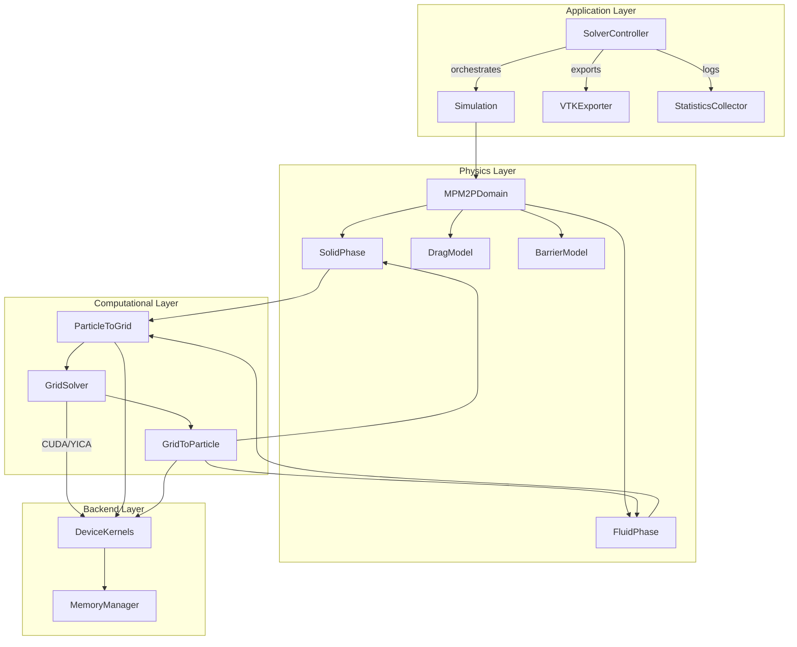

# Two-Phase MPM Solver Architecture Design v1.0

**Project**: Reproduction of Ng et al. (2023) Two-phase MPM Debris Flow Impact  
**Design Phase**: Phase 1 of TDD Development Protocol  
**Date**: 2025-01-19  
**Author**: AI Agent following TDD methodology  

## Executive Summary

This document specifies the high-precision architectural design for implementing the two-phase Material Point Method (MPM) solver described in Ng et al. (2023). The design prioritizes production-grade elegance, cross-platform CUDA/YICA backend support, and comprehensive testability following Test-Driven Development (TDD) principles.

## Architecture Overview



## Core Class Design

### 1. MPM2PDomain (@ti.data_oriented)

**Purpose**: Central domain orchestrating two-phase MPM simulation with dual rigid barriers.

**Key Responsibilities**:
- Material point and grid field lifecycle management
- Time integration coordination (adaptive CFL-limited stepping)
- Inter-phase coupling and drag force computation
- Barrier contact detection and response

```python
@ti.data_oriented
class MPM2PDomain:
    def __init__(self, 
                 nx: int, ny: int, nz: int,        # Grid resolution
                 dx: float,                        # Grid spacing
                 max_solid_particles: int,
                 max_fluid_particles: int,
                 backend: str = "cuda"):           # "cuda", "yica", "cpu"
        
        # Grid fields (MAC staggered)
        self.grid_velocity = ti.Vector.field(3, ti.f64, shape=(nx, ny, nz))
        self.grid_pressure = ti.field(ti.f64, shape=(nx, ny, nz))
        self.grid_solid_mass = ti.field(ti.f64, shape=(nx, ny, nz))
        self.grid_fluid_mass = ti.field(ti.f64, shape=(nx, ny, nz))
        
        # Phase managers
        self.solid_phase = SolidPhase(max_solid_particles, nx, ny, nz, dx)
        self.fluid_phase = FluidPhase(max_fluid_particles, nx, ny, nz, dx)
        self.drag_model = DragModel()
        self.barrier_model = BarrierModel()
        
        # Statistics and observability
        self.step_counter = ti.field(ti.i32, shape=())
        self.total_kinetic_energy = ti.field(ti.f64, shape=())
        self.max_velocity_magnitude = ti.field(ti.f64, shape=())
        self.pressure_residual = ti.field(ti.f64, shape=())
    
    def step(self, dt: float) -> Dict[str, float]:
        """Execute one MPM time step with two-phase coupling."""
        pass
    
    def get_statistics(self) -> Dict[str, float]:
        """Return current simulation statistics for monitoring."""
        pass
```

### 2. SolidPhase (@ti.data_oriented)

**Purpose**: Manages solid phase material points with shear rate-dependent Drucker-Prager plasticity.

**Constitutive Model**: Non-associated plasticity with return mapping algorithm implementing Equations 11-21 from the paper.

```python
@ti.data_oriented  
class SolidPhase:
    def __init__(self, max_particles: int, nx: int, ny: int, nz: int, dx: float):
        # Material point fields
        self.position = ti.Vector.field(3, ti.f64, max_particles)
        self.velocity = ti.Vector.field(3, ti.f64, max_particles) 
        self.mass = ti.field(ti.f64, max_particles)
        self.volume = ti.field(ti.f64, max_particles)
        self.solid_fraction = ti.field(ti.f64, max_particles)
        
        # Deformation and stress
        self.deformation_gradient = ti.Matrix.field(3, 3, ti.f64, max_particles)
        self.elastic_strain = ti.Matrix.field(3, 3, ti.f64, max_particles)
        self.plastic_strain = ti.Matrix.field(3, 3, ti.f64, max_particles)
        self.cauchy_stress = ti.Matrix.field(3, 3, ti.f64, max_particles)
        
        # Plasticity state variables
        self.equivalent_plastic_strain = ti.field(ti.f64, max_particles)
        self.plastic_strain_rate = ti.field(ti.f64, max_particles)
        self.yield_stress = ti.field(ti.f64, max_particles)
        
        # Rheological parameters (from physics_config.yaml)
        self.load_material_parameters()
    
    @ti.kernel
    def particle_to_grid_transfer(self, grid_fields: ti.template()):
        """P2G transfer with APIC momentum conservation (Eq. 5)."""
        pass
        
    @ti.kernel  
    def compute_stress_update(self, dt: float):
        """Drucker-Prager return mapping with rate-dependent friction (Eqs. 17-18)."""
        pass
        
    @ti.kernel
    def grid_to_particle_transfer(self, grid_fields: ti.template()):
        """G2P transfer with PIC/FLIP mixing and position update."""
        pass
```

### 3. FluidPhase (@ti.data_oriented)

**Purpose**: Incompressible Newtonian fluid phase with pressure projection method.

**Key Features**:
- Operator splitting for incompressibility enforcement (Eq. 9)
- Viscous stress computation with solid fraction dependency (Eq. 10)  
- Pressure Poisson solver with conjugate gradient iteration

```python
@ti.data_oriented
class FluidPhase:
    def __init__(self, max_particles: int, nx: int, ny: int, nz: int, dx: float):
        # Material point fields
        self.position = ti.Vector.field(3, ti.f64, max_particles)
        self.velocity = ti.Vector.field(3, ti.f64, max_particles)
        self.pressure = ti.field(ti.f64, max_particles)
        self.density = ti.field(ti.f64, max_particles) 
        self.mass = ti.field(ti.f64, max_particles)
        
        # Grid-based pressure solver fields
        self.divergence = ti.field(ti.f64, shape=(nx, ny, nz))
        self.pressure_rhs = ti.field(ti.f64, shape=(nx, ny, nz)) 
        self.pressure_solution = ti.field(ti.f64, shape=(nx, ny, nz))
        
        # Conjugate gradient solver workspace
        self.cg_r = ti.field(ti.f64, shape=(nx, ny, nz))
        self.cg_p = ti.field(ti.f64, shape=(nx, ny, nz))
        self.cg_ap = ti.field(ti.f64, shape=(nx, ny, nz))
        
        # Physical parameters
        self.fluid_density = 1000.0  # kg/m³
        self.fluid_viscosity = 1e-3  # Pa·s
    
    @ti.kernel
    def compute_viscous_stress(self, solid_fraction_field: ti.template()):
        """Compute fluid viscous stress with solid fraction effects (Eq. 10)."""
        pass
        
    @ti.kernel  
    def solve_pressure_poisson(self, dt: float, tolerance: float = 1e-6) -> int:
        """Pressure projection using conjugate gradient iteration."""
        pass
        
    @ti.kernel
    def apply_pressure_correction(self, dt: float):
        """Update fluid velocity to enforce incompressibility."""
        pass
```

### 4. DragModel (@ti.data_oriented)

**Purpose**: Inter-phase momentum exchange and fluidization effects.

**Mathematical Framework**: 
- Drag force computation following Van der Hoef et al. (2005) formulation (Eq. 22)
- Fluidization ratio calculation and bed friction modification (Eqs. 25-26)

```python
@ti.data_oriented
class DragModel:
    def __init__(self):
        # Drag correlation parameters
        self.particle_diameter = 1e-3  # m
        self.drag_coefficient = 18.0
        
        # Fluidization tracking
        self.fluidization_ratio = ti.field(ti.f64, shape=())
        self.bed_friction_reduction = ti.field(ti.f64, shape=())
    
    @ti.func  
    def compute_drag_coefficient(self, solid_fraction: float, reynolds_number: float) -> float:
        """Van der Hoef drag correlation F̂(Re, φ)."""
        pass
        
    @ti.kernel
    def compute_interphase_forces(self, 
                                 solid_particles: ti.template(),
                                 fluid_particles: ti.template(),
                                 drag_forces: ti.template()):
        """Compute drag forces between phases (Eq. 22)."""
        pass
        
    @ti.kernel  
    def update_fluidization_ratio(self, 
                                 pressure_field: ti.template(),
                                 stress_field: ti.template()):
        """Calculate λ = pf/(pf + σ') and friction reduction (Eq. 26).""" 
        pass
```

### 5. BarrierModel (@ti.data_oriented)

**Purpose**: Rigid barrier geometry, contact detection, and overflow mechanics.

**Key Capabilities**:
- Dual barrier configuration with adjustable spacing
- Contact force computation using penalty method
- Overflow trajectory tracking and landing distance calculation (Eqs. 3-4)

```python
@ti.data_oriented
class BarrierModel:
    def __init__(self, barrier_height: float, barrier_spacing: float):
        # Barrier geometry
        self.barrier_positions = ti.Vector.field(3, ti.f64, shape=2)  # Two barriers
        self.barrier_heights = ti.field(ti.f64, shape=2)
        self.barrier_normals = ti.Vector.field(3, ti.f64, shape=2)
        
        # Contact detection parameters
        self.contact_stiffness = 1e8  # N/m
        self.contact_damping = 1e3    # N·s/m  
        self.friction_coefficient = 0.4
        
        # Overflow tracking
        self.overflow_particles = ti.field(ti.i32, shape=10000)  # Particle IDs
        self.landing_distances = ti.field(ti.f64, shape=10000)
        self.launch_velocities = ti.field(ti.f64, shape=10000)
        
        self.initialize_barriers(barrier_height, barrier_spacing)
    
    @ti.kernel
    def detect_contacts(self, 
                       particle_positions: ti.template(),
                       contact_forces: ti.template()):
        """Detect particle-barrier contacts and compute penalty forces."""
        pass
        
    @ti.kernel
    def track_overflow_kinematics(self, 
                                 particle_positions: ti.template(),
                                 particle_velocities: ti.template()):
        """Monitor overflow trajectories and compute landing statistics."""
        pass
        
    def calculate_theoretical_landing_distance(self, launch_velocity: float, 
                                             launch_angle: float) -> float:
        """Analytical trajectory calculation (Eq. 3).""" 
        pass
```

### 6. SolverController (Application Layer)

**Purpose**: High-level simulation orchestration, I/O, and monitoring.

```python
class SolverController:
    def __init__(self, config_path: str):
        self.config = self.load_configuration(config_path)
        self.domain = MPM2PDomain(**self.config['domain'])
        self.exporter = VTKExporter(self.config['output'])
        self.statistics = StatisticsCollector()
        
        # Performance monitoring
        self.timers = {
            'p2g_transfer': 0.0,
            'grid_solve': 0.0, 
            'g2p_transfer': 0.0,
            'contact_detection': 0.0,
            'total_step': 0.0
        }
    
    def run_simulation(self, total_time: float, output_frequency: int = 100):
        """Execute full simulation with adaptive time stepping and monitoring."""
        pass
        
    def export_results(self, timestep: int):
        """Export VTK files and update statistics."""
        pass
        
    def validate_against_experiments(self, experimental_data_path: str) -> Dict[str, float]:
        """Compare simulation results with experimental validation data."""
        pass
```

## Backend Abstraction Layer

### Device-Agnostic Kernel Design

To support both CUDA and YICA backends, all compute kernels are designed with device abstraction:

```python
@ti.kernel
def device_agnostic_kernel():
    # All kernels use Taichi's built-in device abstraction
    # No backend-specific code in physics implementations
    ti.loop_config(serialize=False)  # Enable parallelization
    for i in range(n_particles):
        # Computation logic independent of backend
        pass
```

### Memory Layout Optimization

**Structure of Arrays (SoA) Design**:
- Separate fields for position, velocity, mass to optimize memory coalescing
- Contiguous memory layout for efficient GPU transfers
- Page-aligned allocation for YICA backend compatibility

```python
# Optimized memory layout
class OptimizedParticleData:
    # SoA layout for GPU efficiency
    positions = ti.Vector.field(3, ti.f64)      # [x1, y1, z1, x2, y2, z2, ...]
    velocities = ti.Vector.field(3, ti.f64)     # [vx1, vy1, vz1, vx2, vy2, vz2, ...]
    masses = ti.field(ti.f64)                   # [m1, m2, m3, ...]
```

## API Contracts & Interfaces

### 1. Boundary Condition Interface

```python
class BoundaryCondition:
    """Abstract base class for boundary condition implementations."""
    
    @ti.func
    def apply_constraint(self, particle_id: int, position: ti.Vector, velocity: ti.Vector) -> ti.Vector:
        """Apply boundary constraint and return corrected velocity."""
        pass
        
    @ti.func  
    def get_reaction_force(self, particle_id: int) -> ti.Vector:
        """Return reaction force from boundary constraint."""
        pass

class RigidWallBC(BoundaryCondition):
    """Rigid wall with Coulomb friction."""
    pass
    
class PeriodicBC(BoundaryCondition):
    """Periodic boundary conditions."""
    pass
```

### 2. Constitutive Model Interface  

```python
class ConstitutiveModel:
    """Base class for material constitutive relationships."""
    
    @ti.kernel
    def compute_stress_update(self, strain_increment: ti.Matrix, dt: float) -> ti.Matrix:
        """Update stress state given strain increment."""
        pass
        
    @ti.func
    def get_tangent_stiffness(self) -> ti.Matrix:
        """Return current tangent stiffness matrix."""
        pass

class DruckerPragerModel(ConstitutiveModel):
    """Shear rate-dependent Drucker-Prager with return mapping."""
    pass
```

### 3. Export Interface

```python
class DataExporter:
    """Base class for simulation result export."""
    
    def export_timestep(self, timestep: int, time: float, domain: MPM2PDomain):
        """Export simulation state at given timestep."""
        pass

class VTKExporter(DataExporter):
    """ParaView-compatible VTK export."""
    
    def export_particles(self, particles: ParticleData, filename: str):
        """Export particle data with scalar and vector fields."""
        pass
        
    def export_grid(self, grid_fields: GridData, filename: str):  
        """Export background grid with pressure and velocity."""
        pass
```

## Data Structure Specifications

### Material Point Data Layout

```python
# Particle data organized for cache-efficient access
@ti.dataclass  
class ParticleState:
    position: ti.math.vec3         # Current position [m]
    velocity: ti.math.vec3         # Current velocity [m/s]  
    mass: ti.f64                   # Particle mass [kg]
    volume: ti.f64                 # Current volume [m³]
    density: ti.f64                # Current density [kg/m³]
    
    # Solid phase specific
    solid_fraction: ti.f64         # Volume fraction φ [-]
    deformation_gradient: ti.math.mat3  # F tensor
    elastic_strain: ti.math.mat3   # Elastic logarithmic strain
    plastic_strain: ti.f64         # Accumulated plastic strain
    
    # Fluid phase specific  
    pressure: ti.f64               # Fluid pressure [Pa]
    viscous_stress: ti.math.mat3   # Viscous stress tensor
```

### Background Grid Organization

```python
# Semi-staggered MAC grid for pressure-velocity coupling
@ti.dataclass
class GridCell:
    # Velocity components (face-centered)
    velocity_x: ti.f64      # u-velocity on x-faces
    velocity_y: ti.f64      # v-velocity on y-faces  
    velocity_z: ti.f64      # w-velocity on z-faces
    
    # Scalar quantities (cell-centered)
    pressure: ti.f64        # Fluid pressure
    solid_mass: ti.f64      # Solid phase mass
    fluid_mass: ti.f64      # Fluid phase mass
    solid_fraction: ti.f64  # Average solid volume fraction
```

## Performance & Memory Requirements

### Computational Complexity Analysis

| Operation | Complexity | Memory Access Pattern | GPU Efficiency |
|-----------|------------|----------------------|----------------|
| P2G Transfer | O(np × 27) | Scattered writes | Good with atomics |  
| Grid Solve | O(nx³) | Regular stencil | Excellent |
| G2P Transfer | O(np × 27) | Coalesced reads | Excellent |
| Contact Detection | O(np) | Irregular | Moderate |
| Pressure Solve | O(nx³ log nx³) | Sparse matrix | Good with CG |

### Memory Layout Optimization

**Target Memory Footprint (500m³ simulation)**:
- Solid particles: 50,000 × 200 bytes = 10 MB
- Fluid particles: 50,000 × 120 bytes = 6 MB  
- Background grid: 128³ × 80 bytes = 168 MB
- Auxiliary arrays: ~200 MB
- **Total: < 400 MB** (well within 8GB target)

## Testing Strategy & TDD Integration

### Unit Test Categories

1. **Physics Validation Tests**:
   - Momentum conservation in P2G/G2P transfers
   - Drucker-Prager yield surface accuracy 
   - Incompressible flow solver convergence
   - Contact force impulse conservation

2. **Performance Benchmark Tests**:
   - Memory bandwidth utilization  
   - Computational throughput (MLUPS)
   - Scaling efficiency across GPU architectures

3. **Integration Validation Tests**:
   - Single barrier impact force reproduction
   - Two-phase coupling stability
   - Experimental data matching (RMSE targets)

### Test-Driven Development Workflow

```python
# Example unit test structure
class TestSolidPhase:
    def test_drucker_prager_yield_surface(self):
        """Verify yield surface equation accuracy within 1e-10 tolerance."""
        assert abs(computed_yield - analytical_yield) < 1e-10
        
    def test_return_mapping_convergence(self):
        """Ensure return mapping converges within 5 iterations.""" 
        assert iterations_required <= 5
        
    def test_momentum_conservation_p2g(self):
        """Validate total momentum conservation in P2G transfer."""
        assert abs(initial_momentum - final_momentum) < 1e-12
```

## Production-Readiness Checklist

### Observability & Monitoring

1. **Performance Metrics**:
   - Timestep execution time breakdown
   - Memory usage tracking and leak detection
   - GPU utilization and memory bandwidth

2. **Physics Diagnostics**: 
   - Energy conservation monitoring
   - Mass conservation verification  
   - Pressure solver residual tracking

3. **Simulation Health Checks**:
   - CFL condition monitoring
   - Maximum velocity/acceleration limits
   - Non-physical state detection (negative masses, NaN values)

### Error Handling & Resilience

```python
class MPMSimulationError(Exception):
    """Base exception for MPM simulation errors."""
    pass

class PhysicsViolationError(MPMSimulationError):
    """Raised when unphysical states are detected."""
    pass
    
class ConvergenceError(MPMSimulationError):
    """Raised when iterative solvers fail to converge."""
    pass
```

### Configuration Management

```yaml
# Production deployment configuration
simulation:
  domain:
    resolution: [128, 128, 128]
    extent: [2.56, 2.56, 2.56]  # meters
  
  performance:
    backend: "cuda"
    memory_pool_size: 4GB
    max_particles_per_cell: 16
    cfl_safety_factor: 0.5
  
  monitoring:
    enable_profiling: true
    checkpoint_interval: 1000  # timesteps
    statistics_output: "stats.json"
```

## Conclusion

This architectural design provides a solid foundation for implementing the two-phase MPM solver with the following key advantages:

1. **Production-Grade Quality**: Clean interfaces, comprehensive error handling, observability
2. **Cross-Platform Support**: Device-agnostic kernels supporting CUDA and YICA backends  
3. **Testability**: Modular design enabling comprehensive unit and integration testing
4. **Performance**: Memory-efficient data structures and GPU-optimized algorithms
5. **Maintainability**: Clear separation of concerns and well-documented APIs

The design follows the TDD development protocol, enabling iterative implementation with continuous validation against experimental data from Ng et al. (2023).

**Next Steps**: Proceed to Phase 2 (Unit Test Scaffolding) to implement the test framework that will guide the implementation of these architectural components.